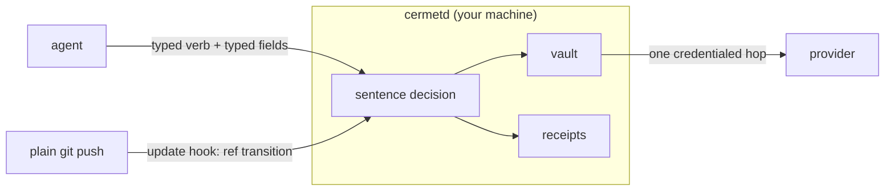

# Cermet

**Aggregate Credentials, Disaggregate Authority**

Cermet authorizes agent *effects*, not traffic. Your agent asks for a typed provider
effect — refund *this charge*, push *this branch*, deploy *this project* — and a daemon
on your machine decides it against sentences you wrote, executes the allowed ones with
credentials the agent never holds, and writes every decision into a hash-chained local receipt log.

[cermet.dev](https://cermet.dev) ·
[quickstart](https://cermet.dev/quickstart.html) ·
[the WHERE index](https://cermet.dev/predicates.html) ·
[for agents](https://cermet.dev/agents.html)


<a href="https://cermet.dev/#demo"></a>

*The whole first session as a scripted replica — the words are what the shipped CLI
prints. Or [type it yourself](https://cermet.dev/#demo).*

```text
Not  "this agent may use the Stripe credential."
Not  "this agent may POST to api.stripe.com."
But  "this agent may refund this charge, up to $50."
```

## What that looks like

Authority is a file of sentences. One line is one grant of authority, and the rule
reads as the intent:

```cermet
allow github.fetch  where owner = "you" and name = "your-repo"
allow github.push   where owner = "you" and name = "your-repo"
allow stripe.refund where charge = "ch_3TyX" and amount <= 5000
allow vercel.deploy where project = "your-site" and target = "preview"
```

A push inside the rules is just a push — the receipt arrives in git's own output:

```text
$ git push origin main
remote: cermet: carried main@9f8734c to you/your-repo (request req_9f2c41d8a3e07b55)
```

A push outside the rules is refused, and the refusal computes the exact sentence that
would allow it — for you to apply, never the agent:

```text
$ git push origin main
remote: cermet: no standing authority for main on you/new-project
remote: cermet:   to allow: cermet rules allow 'github.push where owner = "you" and name in {"your-repo", "new-project"}'
remote: error: hook declined to update refs/heads/main
```

And every decision — allow and deny alike — is a typed, hash-chained row that carries
the admitting sentence, the frozen fields, and the reason the agent gave:

```text
$ cermet log
2026-08-11T22:45:36Z  ALLOW vercel.deploy req_62366a4587cd9c0f — allowed by: allow vercel.deploy
    where project = "your-site" and target = "preview" — "Deploying the landing-page fix for review"
2026-08-11T23:18:55Z  DENIED stripe.refund req_3e047e679794bf0b: no sentence admits it — amount=9000
```

## How it works



One binary, three roles, one trust boundary. `cermet` is a multicall executable;
`cermetd` and `git-remote-cermet` are relative symlinks to it that select a role by
name:

- **`cermetd`** — the daemon role, launched only by the service manager under a
  dedicated non-login uid. Owns the encrypted vault, decides every effect against
  the sentence corpus, executes the credential-bearing hop, writes the receipts.
  Three sockets, three audiences: operator ctl, agent bridge, git plane.
- **`cermet`** — the operator CLI (`check`, `connect`, `rules`, `doc`, `run`,
  `catalog`, `log`, `audit-verify`) and the MCP stdio server (`cermet mcp`), which
  exposes every verb a standing sentence admits as a typed tool.
- **`git-remote-cermet`** — git's own transport helper: wire a remote as
  `cermet::github/<owner>/<repo>` and plain `git push` routes its one credentialed
  hop through the broker while git keeps doing everything else.

One file also means one build: an agent session opened against a daemon from a
different build is refused at its handshake instead of quietly speaking an obsolete
protocol.

The credential meets the work in one of three shapes, chosen by what the native tool
can do:

- **Frozen call** (Stripe): the broker executes the exact request your sentence
  approved — fields sealed before the grant exists; the agent runs nothing.
- **Native seam** (git): the remote points at the broker; the update hook decides the
  actual ref transition (repository, branch, old and new object id) and a credentialed
  runner carries mirror → upstream. No wrapper, no token in the repo.
- **Relay window** (Vercel): the native CLI drives its own protocol against a
  loopback relay with an inert handle; each HTTP hop is checked against the approved
  shape, stamped with the real credential, and forwarded — a hop outside the shape is
  refused and the window burns.

## Guarantees

*The adversaries these guarantees are scoped to are named in
[`docs/REFERENCE.md`](docs/REFERENCE.md) (Named adversaries); the provider integration
doctrine — the honest answer to "isn't this just another proxy?" — is
[`docs/provider_design_principles.md`](docs/provider_design_principles.md).*

- **Deny by default.** A request that doesn't parse into a known verb with typed
  fields does not exist. Access requires a definite allow; absence is never permission.
- **Approved fields are executed fields.** Every executed field is frozen and
  integrity-bound before the grant is minted. There is no execute-time fill channel.
- **The agent surface is keyless.** Agents are identified by the kernel's own socket
  peer credentials (`SO_PEERCRED` uid checks on every request), not bearer tokens — there
  is no client-side secret to steal, and the raw provider credential never leaves the
  daemon.
- **Authority changes are human acts.** Applying or widening sentences is
  presence-gated at the physical screen; no approve or auto-approve tool exists on the
  agent surface, by construction.
- **Every decision is evidence.** Allow and deny land as typed, hash-chained rows —
  verifiable with `cermet audit-verify`, denials kept losslessly with the values that
  were refused.

## Install

From a packaged release — download, **check the sha**, then install. `SHA256SUMS` ships
beside the artifacts on the same release; nothing should run before it matches:

```sh
# Debian/Ubuntu
curl -fsSLO https://github.com/suarezc/cermet/releases/download/v0.1.0/cermet_0.1.0_amd64.deb
curl -fsSL  https://github.com/suarezc/cermet/releases/download/v0.1.0/SHA256SUMS | sha256sum -c --ignore-missing
sudo dpkg -i cermet_0.1.0_amd64.deb            # postinst prints the one setup step

# Tarball (macOS arm64 shown; linux_amd64 the same): one binary plus its two role aliases
curl -fsSLO https://github.com/suarezc/cermet/releases/download/v0.1.0/cermet_0.1.0_darwin_arm64.tar.gz
curl -fsSL  https://github.com/suarezc/cermet/releases/download/v0.1.0/SHA256SUMS | shasum -a 256 -c --ignore-missing
tar -xzf cermet_0.1.0_darwin_arm64.tar.gz
./cermet setup                                  # asks for administrator access itself
```

Uninstalling is documented step-by-step in the [quickstart](docs/QUICKSTART.md#11-uninstall); `cermet uninstall` ships in 0.1.1.

**Containers.** cermetd runs under the init system — systemd on Linux, launchd on macOS —
because the init system is what delivers the sealed vault key to the daemon and supervises
it. systemd will only act as the system manager from PID 1: the kernel gives PID 1 the
semantics a supervisor needs (orphaned processes reparent to it, unhandled fatal signals
are ignored, it owns the cgroup root), and systemd refuses to run as the system instance
anywhere else. A default Docker container has no init at all — *your* process is PID 1 and
supervision belongs to the engine — so `setup` inside `docker run ubuntu` fails, and it is
systemd's constraint, not a check of ours. A systemd-booting image works fine; this is the
same shape this project's own test suite boots:

```sh
docker run -d --name cermet-box --privileged --cgroupns=host \
  -v /sys/fs/cgroup:/sys/fs/cgroup:rw jrei/systemd-ubuntu:24.04
# podman: podman run -d --name cermet-box --systemd=always --privileged jrei/systemd-ubuntu:24.04

# setup derives the human approver from SUDO_USER, so install as a sudoer, not bare root:
docker exec cermet-box bash -c 'apt-get update -q && apt-get install -yq sudo &&
  useradd -m -s /bin/bash dev &&
  printf "dev ALL=(ALL) NOPASSWD:ALL\n" > /etc/sudoers.d/dev && chmod 0440 /etc/sudoers.d/dev'
docker cp cermet_0.1.0_amd64.deb cermet-box:/tmp/
docker exec -u dev cermet-box bash -lc 'sudo dpkg -i /tmp/cermet_0.1.0_amd64.deb'
```

One honesty note: a container has no TPM, so `setup` lands on the `file-protected` custody
rung — the vault key is a root-protected file on the container's volume — and `cermet check`
will say exactly that.

From source — Rust only, toolchain pinned by the repo:

```sh
cargo install --path crates/cermet-bin      # -> cermet (the one executable)
sudo "$(command -v cermet)" setup           # absolute path: sudo's PATH is not yours
```

`setup` publishes the binary and creates `cermetd` and `git-remote-cermet` beside it
as relative symlinks — role names, not separate programs.

Then follow the [quickstart](https://cermet.dev/quickstart.html): prove the plumbing
(`cermet check`), connect a provider, write your first sentence, let the agent work.

Staying current: `cermet update [--check]` installs whatever this project's GitHub Releases
publishes as latest, through the channel this box was installed by — dpkg for a package install,
the same publish `setup` uses otherwise — after verifying the download against that release's own
SHA256SUMS. Cargo- or Homebrew-installed instead? It hands the upgrade back to that tool (its own
command, then `sudo <that path> setup` to republish the system install) and changes nothing itself
— package-manager installs stay package-manager-managed. A daily timer runs the CHECK half only
(`cermet update --daily-check`, on by default, `cermet update --daily off` to stop it) — one
parameterless GET of the release channel, a second GET of that release's checksums only when it's
newer, a local notice, and nothing installed. It is the only other thing in Cermet that ever
contacts GitHub on its own; typing `cermet update` is still what installs anything.

## Configuration

`/etc/cermetd/config.toml`, installed by `cermet setup`:

| Key | Default | What it is |
| --- | --- | --- |
| `service_user` | `cermet` | dedicated non-login user the daemon runs as |
| `approver_uid` | *(set at install)* | the human operator's uid — presence ceremonies bind here |
| `agent_uid` | *(set at install)* | the agent trust domain's uid, peer-credential-checked per request |
| `runtime_dir` | `/run/cermetd` | operator ctl socket |
| `agent_runtime_dir` | `/run/cermetd-agents` | agent bridge socket |
| `sentence_rules_path` | `/etc/cermetd/sentences/rules.cermet` | the served authority corpus |
| `custody_profile` | *(set at install)* | which mechanism holds the vault key — `systemd-tpm2+host` / `systemd-host` / `file-protected`, chosen by `cermet setup` as the strongest rung the box can carry and required in service mode; `cermet check` reports it |

## Development

```sh
cargo nextest run --workspace   # the full suite, seconds not minutes
cargo fmt --all -- --check
make -C dist verify             # packaging-structure checks
```

Layout:

- `crates/cermet-core` — policy, broker, vault, audit, provider execution (the trusted core)
- `crates/cermet-bin` — the ONE shipped executable: the closed dispatch table over the roles
- `crates/cermet-daemon` — the daemon role (library)
- `crates/cermet-cli` — the operator CLI, MCP server, and git remote helper (library)
- `crates/cermet-lang` — the sentence language (parser, evaluator, shadow checker)
- `crates/cermet-ipc` — the socket protocol shared by all three planes
- `docs/` — the language reference ([LANGUAGE](docs/LANGUAGE.md), [GRAMMAR](docs/GRAMMAR.md)),
  settled design ([REFERENCE](docs/REFERENCE.md)), provider doctrine, and the
  [quickstart](docs/QUICKSTART.md)

## Status

v0.1.0. Pure Rust. Linux and macOS daemons. GitHub, Stripe, and Vercel
today. [cermet.dev](https://cermet.dev) ships through Cermet itself — the agent that
deploys it never sees a token.

## License

MIT — see [LICENSE](LICENSE).
