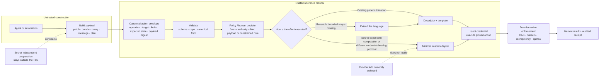
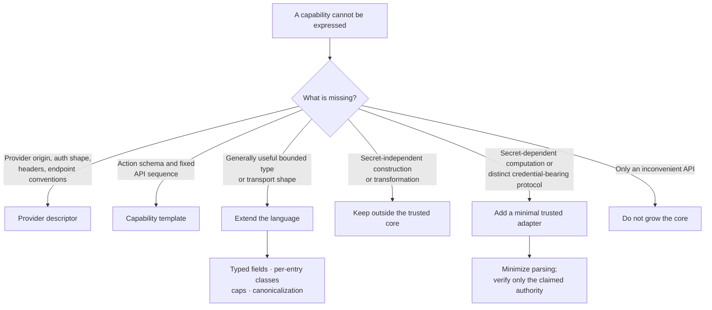

# Provider design principles — construction, authorization, credentialed execution

This doc governs provider shape: consult it before adding any provider capability, any grammar
type, or any line of trusted code.

Cermet is not a universal trusted execution engine. It is a **small semantic reference monitor
surrounded by untrusted builders and provider-native enforcement**: it adds a semantic
authorization plane above machinery the providers already ship.

---

## Part I — The doctrine

The general principle is: separate construction from authorization, and authorization from
credentialed execution.

> Untrusted agents may construct intent and payloads. A trusted broker authorizes a canonical,
> bounded effect, freezes its authority, binds either the exact payload or a declared typed and
> capped payload hole, and performs only the minimum credential-dependent operation. Every exact
> payload byte is bound before credential use.

### The canonical action envelope

Every capability should answer six questions before a credential is used:

| Dimension | What gets bound | Examples |
|---|---|---|
| Operation | What semantic action? | commit, deploy, query, send, pay, sign |
| Authority | Where and to whom? | repo/ref, project/environment, database/schema, recipients, payee |
| Payload | Exactly which material? | canonical manifest plus byte digest and size |
| State | Against which known version? | old SHA, deployment revision, row version, idempotency key |
| Limits | What cannot vary freely? | paths, amount, modes, row count, region, output size |
| Outcome | How is the effect proved and recovered? | success predicate, provider request ID, reconciliation, retry class |

The invariant is not merely "approved bytes equal executed bytes." It is:

> The effect understood by the provider must equal the effect represented on the approval
> boundary.

If the provider sees structured paths but the broker sees only an opaque blob, path-level
approval is not real. Either use a provider's structured API, add a minimal verifier, or
explicitly authorize the broader opaque effect. The same rule applies to outcomes: HTTP delivery
is not proof of a provider effect unless the provider's response semantics make it so.

### Where each kind of logic belongs

### How it generalizes

| Domain | Built outside the core | Approved capability | Minimal credentialed act |
|---|---|---|---|
| Git | Change manifest or pack | Repo, ref, old SHA, paths, modes, digest | Create commit/update ref |
| Deployment | Build artifact | Project, environment, artifact digest, rollout mode | Upload and deploy |
| Database | Query or query plan | Database, statement class, tables, row/byte caps | Execute through DB connection |
| Email | Body and attachments | Sender, recipients, thread, attachment digests | Send through mail API |
| Payments | Payment instruction | Payee, amount, currency, invoice, idempotency key | Submit payment |
| Code signing | Artifact digest | Identity, purpose, digest, expiry | HSM/KMS signature |
| Kubernetes | Manifest | Cluster, namespace, resource kinds/names, digest | Apply through API |
| Cloud changes | Desired-state plan | Account, region, resource set, plan digest | Execute provider mutations |

Across all of them, the agent should control expressive construction but possess neither the
credential nor a reusable signing/execution oracle.

### The doctrine, compact

> Provider specificity belongs in descriptors and capability templates. General, safely bounded
> data shapes belong in the language. Secret-independent construction stays outside the trusted
> boundary. The trusted core grows only for secret-dependent computation or a genuinely
> different credential-bearing wire protocol — and then only with the minimum parsing required
> to prove that the provider-visible effect matches the approved capability.

### Verbs model effects, not endpoints

> A verb is a human-legible EFFECT; the provider's API menu is implementation detail, never the
> design space. When one effect needs several provider calls, that is ONE multi-step verb
> (`http.steps` is a list), not several verbs — one grant, one receipt, with the receipt
> DERIVED from broker-held data rather than echoed from the request. The parity baseline for any
> effect is the NATIVE tool's organic behavior: a git write is `git push` over git's own
> transport, not a sequence of commit-authoring API calls. Reproduce that behavior faithfully and
> use credential-less native binaries for authorship — the trusted seam Cermet replaces is
> credentialed transport only, so "no child process" means no CREDENTIALED child process. An
> endpoint-first framing costs real fidelity: GitHub's file-addition primitive carries no mode
> field, so a commit authored through it silently loses file modes that git itself preserves.

### A key that carries authority is bound, not blocked

> A relay verb's declarations (`query_keys`, `body_keys`) are VOCABULARY: the keys a shape knows
> about, and therefore the ones a sentence or a request may pin. They refuse nothing on their own.
> Authority lives in a key's VALUE, and the only thing that constrains a value is a **bind** to a
> frozen field (`bind: query.teamId: team`). So ratifying a shape means classifying every position
> whose value could decide where an effect lands: either it is bound, or it is declared
> **authority-free** in the ratified document's own comment, with the reason.
> The defect this closes: `teamId` was widened onto every `vercel.deploy` shape (a team
> account's CLI stamps it on every call), the matcher checked only key MEMBERSHIP, and the
> executed request then carried an account scope the sentence never froze — with Vercel
> auto-creating a project on an unknown name, the blast radius was mint-and-deploy in any team the
> vaulted token reached (T1: injected `--scope` or an edited `.vercel/project.json`; T2: a stale
> one). Key membership was never the answer to that; the bind is.
>
> The converse is the same principle: a key nobody declared is NOT refused. It is the native tool's
> own payload — the project's configuration the CLI folds into a create body, a parameter the
> provider added after the document was written — so it is forwarded and NAMED on the hop's record,
> where an operator can see what rode along and decide whether it is worth pinning. Refusing on
> membership made the broker a content firewall over payloads that decide nothing about which effect
> happens, and forced workarounds worse than the risk: a deploy driven with the project's own
> configuration held aside ships a differently-configured artifact. Widening from observed evidence
> stays the rule — the hop record is now where that evidence arrives.

### A wildcard path segment is a value too

> The same obligation reaches the PATH. A `*` segment in a predicate shape is an admitted position
> whose value carries authority — `/v13/deployments/*` names *which* deployment — so ratifying that
> shape means saying what may fill the wildcard, not merely that something may. The answer usually
> cannot be a frozen field, because the resource does not exist when the sentence is written: it is
> the approved effect's own consequence. So the effect shape `capture:`s it out of its own response
> and each read shape binds `path.*: captured.<name>`. A wildcard left UNBOUND must carry a stated
> reason in the document — shipped `vercel.deploy` leaves `/v9/projects/*` and `/teams/*` unbound
> because both run before the effect and their scope is already pinned by `query.teamId`. The rule
> generalizes past Vercel: any provider whose reads address a resource by id has this shape, and
> "the path matched" is not a classification.

### Assert the outcome, and say that it is detection

> A relay verb's effect shape should compare the provider's own response to the fields the approval
> froze (`assert:`), because provider-side semantic drift is otherwise invisible: an omitted target
> classified as production, a create resolved to a different project. Two rules come with it. The
> comparison must use the SAME encoding as the request bind (`omit:` and all), so the request side
> and the outcome side cannot disagree about what "preview" means. And every sentence written about
> it — in the document, in the docs, in any case study — must say **detection, not prevention**: the
> effect landed before its response could be read. What the assertion buys is a burned session, a
> high-severity receipt carrying frozen-versus-observed, and a deployment id the operator can act on.

### A repeatable write shape declares its budget

> The three obligations above all classify ONE hop. A session is many hops, and a shape that a
> session may repeat is a rate nobody ratified: `vercel.deploy`'s `POST /v2/files` was unlimited in
> count and in aggregate bytes for the whole TTL, so an approved deploy also bought an unbounded
> credentialed pipe into the operator's file store (T2: an accident loop; T1: "while you're there,
> keep uploading"). So: **a repeatable shape that WRITES declares `caps:`** — how many hops, and how
> many aggregate request bytes — sized from observed evidence with generous headroom, because what a
> budget bounds is abuse, not use. Reads stay unbudgeted unless a reason says otherwise; the effect
> is already bounded to one by `once`. The companion rule is about what a cap is FOR: a budget bounds
> VOLUME, never content. If the reason you want one is "the agent might send the wrong bytes", the
> honest question is whether those bytes are already conceded somewhere else in the same verb — for
> `vercel.deploy` they are (the deploy publishes arbitrary content by design), which is exactly
> why the missing-set digest gate was designed and NOT built.

### One effect-bearing shape per window

> A relay window's shape table is reads plus AT MOST ONE effect-bearing mutating shape — the
> `once: true` hop the grant authorizes, and the hop the receipt's verdict pivots on (the audit
> derivation counts only effect-bearing hops as the grant's effect; a read hop's failure after
> the effect landed cannot falsify it). Binds still enforce on EVERY hop. Staging writes may
> exist (`vercel.deploy`'s `POST /v2/files`) but only capped and ruled NON-effect in the ratified
> document, with the concession argument written down — their authority must already be conceded
> by the effect's own content freedom, or they are a second effect wearing a staging costume.
> What the rule buys is burn honesty: any hop can burn the session, and a burn between two
> mutations would leave provider-side partial state that no single-effect receipt can summarize —
> the window would have DONE two things while the grant records one verdict. Between the one
> effect and its observation reads, the same burn is safe by construction: the effect either
> landed (post-effect refusals cannot falsify it) or never fired (nothing executed, nothing to
> undo). A protocol that genuinely needs two mutations is two verbs — or one multi-step FROZEN
> verb where the broker itself drives every step — never one window with two effects.

---

## Part II — Refinements the doctrine carries

**1. The custody ladder — what "zero custody" must mean here.** Three guarantees are easily
conflated: (i) no long-lived secret in the workload (short-lived tokens);
(ii) no bearer credential in the workload (a broker performs requests); (iii) no *reusable
authority* in the workload (the workload can request only a specific approved effect). Cermet
targets all three: the agent holds no credential, no token, and no reusable or unconstrained
oracle — only the ability to *ask* and, after approval, invoke a principal-scoped single-use
handle. An ephemeral runner with a scoped temporary token, branch rulesets and PR gates is strong
**bounded** custody, not credential-zero custody; the semantic action broker is the tier above it.

**2. The transport list is a TCB ratchet; parser surface is the toll.** Each addition to the
generic-transport layer (multipart, structured collections, streaming bodies, Git smart-HTTP…)
deserves the scrutiny of a schema change. A transport earns its place only when the
credential-bearing *wire interaction* is irreducible — and its parser surface counts against it.
"The provider's API is awkward" never qualifies (the doctrine's own dashed edge).

**3. Decompose before admitting a protocol adapter — and do not claim semantics an opaque
payload cannot prove.** Take a raw git push as the shape of a "genuinely different protocol": the
credential-bearing part is only "send bytes with auth, read a short status." Pack *construction*
from agent-writable local objects need not enter the credential boundary — the pack can ride as an
opaque, size-capped, digest-bound payload built outside. A small pkt-line parser can prove the
number of ref commands plus each claimed refname and old/new object ID. It CANNOT prove changed
paths or that the update is a fast-forward: receive-pack has no trustworthy client "force" bit, and
ancestry is a property of the object graph. So an opaque adapter can honestly authorize only
**arbitrary bounded content to an exact ref at an exact old SHA**; a path-scoped or broker-enforced
non-force capability requires provider-native structured enforcement or trusted object-graph
verification. Any protocol adapter starts from that split — what the bytes can prove versus what
the capability claims — not from "import an implementation."

**4. A list type, if one is ever added, needs per-entry field classes rather than an opaque blob
type.** The grammar has scalar fields only. In a bounded structured list, the entry field a human
actually rules on (a path, say) behaves as an execution target even though it rides a list, so such
an extension must let templates declare classes per entry-field — otherwise the exhaustive matcher
and the approval surface cannot render or police entries honestly. It would also owe a
canonicalizer with deterministic ordering, normalized relative `/`-separated paths, rejection of
absolute paths and empty/`.`/`..` components, duplicates and file/directory prefix collisions, and
caps on entry count, decoded payload bytes and encoded wire bytes. Unchanged either way:
identity/side_effect/secret are never runtime-fillable.

**5. The frozen-query rule.** Where a realization is GraphQL (a JSON POST to a pinned
endpoint — no new transport), the query/mutation string is ALWAYS a frozen template constant;
only the variables object carries classified fields. A verb whose query text is agent-fillable
collapses custody tier 3 back to tier 2 in one field. This requires a grammar-level literal form
whose braces are not placeholder syntax; an agent-supplied "query" field is not an acceptable
substitute. GraphQL response semantics are also explicit: a 2xx response containing `errors` is
not success, and every mutation declares the result paths whose presence proves its effect.

**6. Provider parity is declared, never pretended.** The provider-independent envelope is the
design; realizations differ because provider primitives differ — one provider's commit API cannot
set file modes where another's can, and a third's upload is multipart and waits on that transport
being available. Descriptors declare connection properties; each provider's ratified
realization/catalog declares the capability subset it actually implements. Ship real realizations;
never paper over semantic differences to fake a uniform verb.

**7. Minted identity makes the provider an audit surface.** Under a GitHub App credential,
API-created commits attribute to the bot identity and arrive provider-signed ("Verified") — the
remote history itself then distinguishes agent-made changes from human ones. Attribution is a
custody feature, not cosmetics; prefer credential types that yield it.

**8. Provider-native enforcement is the outer wall, not the fence.** Expected-state CAS,
rulesets, idempotency keys and quotas are leaned on deliberately (a moved head yields an honest
provider-declared expected-state conflict and a re-approval — that is correct behavior, not
friction). But the approval boundary must be real on its own: provider enforcement backs the
invariant, it does not substitute for binding the effect at approval.

**9. Outcome semantics are part of the capability, not generic HTTP plumbing.** Every mutating
realization declares (a) the semantic success predicate; (b) which failures prove no effect and
are eligible for retry; (c) the provider's idempotency or expected-state mechanism; (d) how an
ambiguous outcome is reconciled; (e) the provider request/operation identifiers retained in the
receipt; and (f) whether an explicit compensation capability exists. The broker classifies an
attempt as succeeded, definitely failed, ambiguous, or partial. A retry is a fresh attempt with a
fresh single-use grant and re-enters policy; an ambiguous outcome is reconciled before any retry;
compensation is a separate action and never implied by the original grant. Attempt lineage,
payload digest, provider evidence, and retained artifacts make the operation timeline auditable.

**10. Dynamic provider credentials are a credential-source adapter, not descriptor data.** A
descriptor can select an auth presentation shape for an already-usable credential. If a provider
requires secret-dependent signing, exchange, minting, or refresh (GitHub App JWT → installation
token, OAuth refresh, SigV4), that lifecycle is a minimal trusted credential-source adapter. It
uses the same action templates and should normally use the same generic HTTP transport, but it is
still trusted code and pays the TCB-ratchet toll.

**11. Connect stores; capabilities use.** `cermet connect` is a custody ingress, not a provider
operation: it stores the operator-supplied credential byte-for-byte and receipts provider, label,
reference, and replacement status without using the credential. A wrong, expired, wrong-account, or
wrong-mode key fails only when an announced, policy-gated capability first exercises it; that provider
error is receipted like every other attempted use. Provider-specific validity probes do not belong in
descriptors or the vault because they silently use a credential outside the capability boundary and
cannot generalize across the provider surface.
